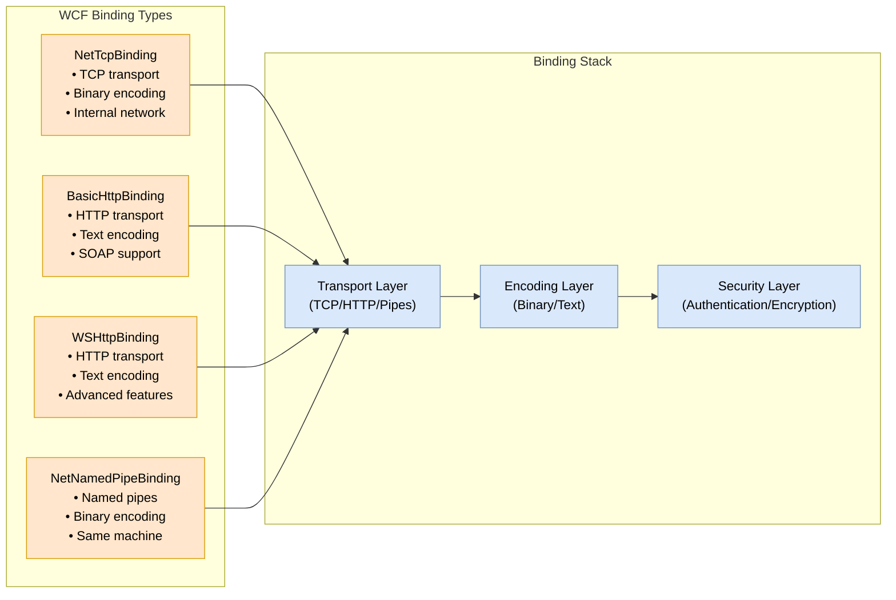

The BestRx Pharmacy System implements three distinct application development approaches, each representing a different era of software development and serving specific business needs. Let's examine how these approaches differ and their key components.

###  Development Approaches Comparison

| Aspect | Legacy Application | Transitional Application | Modern Application |
| --- | --- | --- | --- |
| Technology Stack | VB.NET, Windows Forms, SQL, XML, WCF | C#, ASP.NET, Web APIs, SignalR, Polly | .NET Core microservices, Xamarin |
| Primary Purpose | Prescription verification and patient management | Point-of-sale operations and inventory management | Mobile patient portal and notifications |
| Architecture Style | Monolithic with WCF services | Service-oriented with real-time capabilities | Microservices with event-driven design |
| Data Storage | SQL Server with XML support | SQL Server with Entity Framework | Distributed databases with SQLite offline storage |
| Communication Pattern | WCF services and XML | REST APIs and SignalR | API gateways and message queues |

###  Legacy Application Architecture

The legacy application uses a traditional monolithic architecture with WCF services for communication. Here's how the components interact:

```mermaid
flowchart TD
    subgraph "Legacy Application"
        Client["Windows Forms Client"]
        WCF["WCF Service Layer"]
        DB["SQL Server Database"]
        XML["XML Service"]
        
        Client -->|"NetTcpBinding"| WCF
        WCF -->|"SQL Queries"| DB
        WCF -->|"XML Processing"| XML
    end
    
    subgraph "Transitional Application"
        API["Web API Layer"]
        SignalR["SignalR Hub"]
        Polly["Polly Services"]
        TransDB["SQL Server Database"]
        
        API -->|"REST"| SignalR
        API -->|"Retry Policies"| Polly
        API -->|"Entity Framework"| TransDB
    end
    
    subgraph "Modern Application"
        Gateway["API Gateway"]
        Auth["Authentication Service"]
        Notify["Notification Service"]
        Mobile["Xamarin Mobile App"]
        ModernDB["Distributed Databases"]
        
        Mobile -->|"JWT"| Gateway
        Gateway -->|"OAuth2"| Auth
        Gateway -->|"Hangfire Jobs"| Notify
        Notify -->|"Push Notifications"| Mobile
        Auth -->|"Microservices"| ModernDB
    end
    
    classDef legacy fill:#FFE6CC,stroke:#D79B00,color:#000
    classDef transitional fill:#DAE8FC,stroke:#6C8EBF,color:#000
    classDef modern fill:#D5E8D4,stroke:#82B366,color:#000
    
    class Client,WCF,DB,XML legacy
    class API,SignalR,Polly,TransDB transitional
    class Gateway,Auth,Notify,Mobile,ModernDB modern
```



The diagram above illustrates the three distinct architectural approaches, with:

- Orange components representing the legacy application's monolithic architecture
- Blue components showing the transitional application's service-oriented design
- Green components depicting the modern application's microservices architecture

###  WCF Bindings in the Legacy Application

The legacy application relies heavily on WCF (Windows Communication Foundation) bindings for service communication. These bindings define how services communicate with clients, specifying transport protocols, message encoding, and security mechanisms. Here's how the WCF binding architecture works:



Each WCF binding type serves a specific purpose in the legacy application:

- **NetTcpBinding**: Used for internal prescription verification services, providing optimal performance within the pharmacy's trusted network
- **BasicHttpBinding**: Implemented for communication with older pharmacy systems that only support SOAP protocols
- **WSHttpBinding**: Used for secure communication with external services, supporting advanced security features
- **NetNamedPipeBinding**: Utilized for high-performance communication between components on the same server

###  Daily Disaster Recovery Approaches

Each application type implements a different disaster recovery strategy based on its architecture:

1. **Legacy Application**:
  - Continuous Data Protection (CDP) tools for real-time backup
  - Automated daily database backups
  - WCF service replication for high availability
  - Regular backup of XML configuration files


2. **Transitional Application**:
  - Pilot light approach with core infrastructure replication
  - Automated daily backups with Polly retry logic
  - SignalR hub state preservation
  - Database snapshot retention


3. **Modern Application**:
  - Multi-region deployment strategy
  - Warm standby approach
  - Hangfire job state synchronization
  - Distributed database backup system


This comprehensive approach ensures business continuity across all three applications while leveraging their respective architectural advantages. The modern application's microservices architecture allows for more granular recovery options, while the legacy application's monolithic design requires more traditional backup and restore procedures.

###  Implementation Details

####  Legacy Application Implementation

```sql
-- SQL script to create PrescriptionDB and tables
CREATE DATABASE PrescriptionDB;
GO
USE PrescriptionDB;
GO

CREATE TABLE Patients (
    PatientId INT PRIMARY KEY IDENTITY(1,1),
    FirstName VARCHAR(50) NOT NULL,
    LastName VARCHAR(50) NOT NULL,
    DateOfBirth DATE,
    Address VARCHAR(255),
    Phone VARCHAR(20)
);

CREATE TABLE Prescriptions (
    PrescriptionId INT PRIMARY KEY IDENTITY(1,1),
    PatientId INT FOREIGN KEY REFERENCES Patients(PatientId),
    MedicationName VARCHAR(100) NOT NULL,
    Dosage VARCHAR(50),
    Quantity INT,
    Refills INT,
    PrescribedDate DATE
);

CREATE TABLE Inventory (
    InventoryId INT PRIMARY KEY IDENTITY(1,1),
    MedicationName VARCHAR(100) NOT NULL,
    QuantityOnHand INT
);
```

```vb
' Patient.vb
Public Class Patient
    Public Property PatientId As Integer
    Public Property FirstName As String
    Public Property LastName As String
    Public Property DateOfBirth As Date
    Public Property Address As String
    Public Property Phone As String
End Class

' Prescription.vb
Public Class Prescription
    Public Property PrescriptionId As Integer
    Public Property PatientId As Integer
    Public Property MedicationName As String
    Public Property Dosage As String
    Public Property Quantity As Integer
    Public Property Refills As Integer
    Public Property PrescribedDate As Date
End Class

' DatabaseService.vb
Public Class DatabaseService
    Private ReadOnly connectionString As String = "Data Source=(localdb)\MSSQLLocalDB;Initial Catalog=PrescriptionDB;Integrated Security=True;"
    
    Public Function GetPatient(patientId As Integer) As Patient
        Using connection As New SqlConnection(connectionString)
            Using command As New SqlCommand("SELECT PatientId, FirstName, LastName, DateOfBirth, Address, Phone FROM Patients WHERE PatientId = @PatientId", connection)
                command.Parameters.AddWithValue("@PatientId", patientId)
                connection.Open()
                Using reader As SqlDataReader = command.ExecuteReader()
                    If reader.Read() Then
                        Return New Patient With {
                            .PatientId = Convert.ToInt32(reader("PatientId")),
                            .FirstName = reader("FirstName").ToString(),
                            .LastName = reader("LastName").ToString(),
                            .DateOfBirth = If(DBNull.Value.Equals(reader("DateOfBirth")), Nothing, Convert.ToDateTime(reader("DateOfBirth"))),
                            .Address = reader("Address").ToString(),
                            .Phone = reader("Phone").ToString()
                        }
                    Else
                        Return Nothing
                    End If
                End Using
            End Using
        End Using
    End Function
End Class
```

```xml
<!-- App.config Configuration -->
<system.serviceModel>
    <services>
        <service name="PrescriptionVerification.Services.PrescriptionService">
            <host>
                <baseAddresses>
                    <add baseAddress="net.tcp://localhost:8090"/>
                </baseAddresses>
            </host>
            <endpoint address=""
                      binding="netTcpBinding"
                      contract="PrescriptionVerification.Services.IPrescriptionService">
            </endpoint>
            <endpoint address="mex"
                      binding="mexTcpBinding"
                      contract="IMetadataExchange">
            </endpoint>
        </service>
    </services>
    <bindings>
        <netTcpBinding>
            <binding name="tcpBinding">
                <security mode="None">
                    <transport clientCredentialType="Windows"/>
                </security>
            </binding>
        </netTcpBinding>
    </bindings>
</system.serviceModel>
```

####  Transitional Application Implementation

```sql
-- SQL script to create PharmacyPOS database and tables
CREATE DATABASE PharmacyPOS;
GO
USE PharmacyPOS;
GO

CREATE TABLE Customers (
    CustomerId INT PRIMARY KEY IDENTITY(1,1),
    FirstName VARCHAR(50) NOT NULL,
    LastName VARCHAR(50) NOT NULL,
    Phone VARCHAR(20)
);

CREATE TABLE Products (
    ProductId INT PRIMARY KEY IDENTITY(1,1),
    Name VARCHAR(100) NOT NULL,
    Price DECIMAL(10, 2) NOT NULL,
    StockQuantity INT NOT NULL
);

CREATE TABLE Transactions (
    TransactionId INT PRIMARY KEY IDENTITY(1,1),
    CustomerId INT FOREIGN KEY REFERENCES Customers(CustomerId),
    TransactionDate DATETIME DEFAULT GETDATE(),
    TotalAmount DECIMAL(10, 2) NOT NULL
);

CREATE TABLE TransactionItems (
    TransactionItemId INT PRIMARY KEY IDENTITY(1,1),
    TransactionId INT FOREIGN KEY REFERENCES Transactions(TransactionId),
    ProductId INT FOREIGN KEY REFERENCES Products(ProductId),
    Quantity INT NOT NULL,
    UnitPrice DECIMAL(10, 2) NOT NULL,
    LineTotal DECIMAL(10, 2) NOT NULL
);
```

```csharp
// ProductsController.cs
[ApiController]
[Route("api/[controller]")]
public class ProductsController : ControllerBase
{
    private readonly ApplicationDbContext _context;

    public ProductsController(ApplicationDbContext context)
    {
        _context = context;
    }

    [HttpGet]
    public async Task<ActionResult<IEnumerable<Product>>> GetProducts()
    {
        return await _context.Products.ToListAsync();
    }

    [HttpPost]
    public async Task<ActionResult<Product>> PostProduct(Product product)
    {
        _context.Products.Add(product);
        await _context.SaveChangesAsync();
        return CreatedAtAction(nameof(GetProducts), new { id = product.ProductId }, product);
    }
}

// InventoryHub.cs
public class InventoryHub : Hub
{
    public async Task UpdateInventory(int productId, int newQuantity)
    {
        await Clients.All.SendAsync("ReceiveInventoryUpdate", productId, newQuantity);
    }
}

// InventoryService.cs
public class InventoryService
{
    private readonly ApplicationDbContext _context;
    private readonly IHubContext<InventoryHub> _inventoryHubContext;
    private readonly IAsyncPolicy _retryPolicy;

    public InventoryService(ApplicationDbContext context, IHubContext<InventoryHub> inventoryHubContext)
    {
        _context = context;
        _inventoryHubContext = inventoryHubContext;
        _retryPolicy = Policy
            .Handle<Exception>()
            .WaitAndRetryAsync(3, retryAttempt => TimeSpan.FromSeconds(Math.Pow(2, retryAttempt)));
    }

    public async Task UpdateStock(int productId, int quantityChange)
    {
        await _retryPolicy.ExecuteAsync(async () =>
        {
            var product = await _context.Products.FindAsync(productId);
            if (product != null)
            {
                product.StockQuantity += quantityChange;
                await _context.SaveChangesAsync();
                await _inventoryHubContext.Clients.All.SendAsync("ReceiveInventoryUpdate", productId, product.StockQuantity);
            }
        });
    }
}
```

```json
{
  "ConnectionStrings": {
    "DefaultConnection": "Server=(localdb)\\MSSQLLocalDB;Database=PharmacyPOS;Trusted_Connection=True;MultipleActiveResultSets=true"
  },
  "Logging": {
    "LogLevel": {
      "Default": "Information",
      "Microsoft": "Warning",
      "Microsoft.Hosting.Lifetime": "Information"
    }
  },
  "AllowedHosts": "*"
}
```

####  Modern Application Implementation

```csharp
// NotificationService/Startup.cs
public class Startup
{
    public Startup(IConfiguration configuration)
    {
        Configuration = configuration;
    }

    public IConfiguration Configuration { get; }

    public void ConfigureServices(IServiceCollection services)
    {
        services.AddControllers();
        
        // Configure Hangfire
        services.AddHangfire(configuration => configuration
            .SetDataCompatibilityLevel(CompatibilityLevel.Version_170)
            .UseSimpleAssemblyNameTypeSerializer()
            .UseRecommendedSerializerSettings()
            .UseSqlServerStorage(Configuration.GetConnectionString("HangfireConnection"), new SqlServerStorageOptions
            {
                CommandBatchMaxTimeout = TimeSpan.FromMinutes(5),
                SlidingInvisibilityTimeout = TimeSpan.FromMinutes(5),
                QueuePollInterval = TimeSpan.Zero,
                UseRecommendedIsolationLevel = true,
                DisableGlobalLocks = true
            }));

        // Add the processing server as IHostedService
        services.AddHangfireServer();
    }

    public void Configure(IApplicationBuilder app, IWebHostEnvironment env, IBackgroundJobClient backgroundJobs)
    {
        if (env.IsDevelopment())
        {
            app.UseDeveloperExceptionPage();
        }

        app.UseHttpsRedirection();
        app.UseRouting();
        app.UseAuthorization();
        app.UseEndpoints(endpoints =>
        {
            endpoints.MapControllers();
            endpoints.MapHangfireDashboard();
        });
    }
}

// NotificationService/Services/NotificationJobService.cs
public class NotificationJobService
{
    public void SendWelcomeEmail(string userId, string email)
    {
        BackgroundJob.Enqueue(() => Console.WriteLine($"Sending welcome email to {email} (User ID: {userId})"));
    }

    public void ScheduleRefillReminder(string patientId, string medicationName, DateTime reminderTime)
    {
        BackgroundJob.Schedule(() => Console.WriteLine($"Reminder: Refill {medicationName} for patient {patientId} at {reminderTime}"), reminderTime);
    }
}
```

```csharp
// MobileApp/Services/AuthenticationService.cs
public class AuthenticationService
{
    private readonly HttpClient _httpClient;
    private const string BaseUrl = "https://localhost:5001";

    public AuthenticationService()
    {
        _httpClient = new HttpClient();
    }

    public async Task<string> LoginAsync(string username, string password)
    {
        var loginData = new { Username = username, Password = password };
        var json = JsonSerializer.Serialize(loginData);
        var content = new StringContent(json, System.Text.Encoding.UTF8, "application/json");
        var response = await _httpClient.PostAsync($"{BaseUrl}/api/auth/login", content);
        if (response.IsSuccessStatusCode)
        {
            var responseContent = await response.Content.ReadAsStringAsync();
            return JsonSerializer.Deserialize<string>(responseContent);
        }
        return null;
    }
}

// MobileApp/Database/LocalDatabase.cs
public class LocalDatabase
{
    private readonly SQLiteAsyncConnection _database;

    public LocalDatabase(string dbPath)
    {
        _database = new SQLiteAsyncConnection(dbPath);
        _database.CreateTableAsync<LocalPrescription>().Wait();
    }

    public Task<List<LocalPrescription>> GetPrescriptionsAsync()
    {
        return _database.Table<LocalPrescription>().ToListAsync();
    }

    public Task<int> SavePrescriptionAsync(LocalPrescription prescription)
    {
        if (prescription.Id != 0)
        {
            return _database.UpdateAsync(prescription);
        }
        else
        {
            return _database.InsertAsync(prescription);
        }
    }
}
```

###  Disaster Recovery Implementation

####  Legacy Application Recovery

```powershell
# PowerShell script for daily backup
$SourcePath = "C:\path\to\PrescriptionDB.mdf"
$DestinationPath = "C:\backups\PrescriptionDB_$(Get-Date -Format 'yyyyMMdd').bak"

Backup-SqlDatabase -ServerInstance "(localdb)\MSSQLLocalDB" -Database "PrescriptionDB" -BackupFile $DestinationPath

# Build recovery script
$BackupFile = "C:\backups\PrescriptionDB_latest.bak"
$DatabaseName = "PrescriptionDB"
$DataFile = "C:\path\to\PrescriptionDB.mdf"
$LogFile = "C:\path\to\PrescriptionDB_log.ldf"

Restore-SqlDatabase -ServerInstance "(localdb)\MSSQLLocalDB" -Database $DatabaseName -BackupFile $BackupFile -RelocateDataFile @("$DatabaseName"="$DataFile") -RelocateLogFile @("$DatabaseName_log"="$LogFile") -ReplaceDatabase
```

####  Transitional Application Recovery

```powershell
# PowerShell script for POS database backup
$SourceServer = "(localdb)\MSSQLLocalDB"
$SourceDatabase = "PharmacyPOS"
$BackupPath = "C:\backups\PharmacyPOS_$(Get-Date -Format 'yyyyMMdd_HHmmss').bak"

Backup-SqlDatabase -ServerInstance $SourceServer -Database $SourceDatabase -BackupFile $BackupPath

# Build recovery script
$RestoreServer = "(localdb)\MSSQLLocalDB"
$RestoreDatabase = "PharmacyPOS"
$BackupFile = "C:\backups\PharmacyPOS_latest.bak"
$DataDirectory = "C:\path\to\sql\data"
$LogDirectory = "C:\path\to\sql\log"

Restore-SqlDatabase -ServerInstance $RestoreServer -Database $RestoreDatabase -BackupFile $BackupFile -RelocateDataFile @("$RestoreDatabase"="$DataDirectory\$RestoreDatabase.mdf") -RelocateLogFile @("$RestoreDatabase_log"="$LogDirectory\$RestoreDatabase_log.ldf") -ReplaceDatabase
```

####  Modern Application Recovery

```

```
