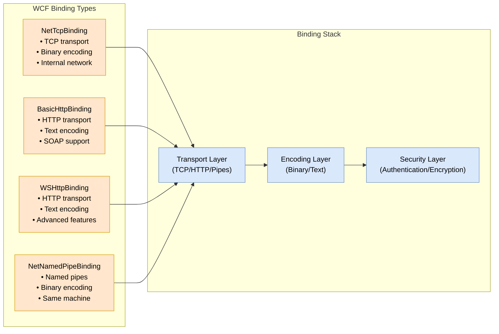

The BestRx Pharmacy System implements three distinct application development approaches, each representing a different era of software development and serving specific business needs. Let's examine how these approaches differ and their key components.

###  Development Approaches Comparison

| Aspect | Legacy Application | Transitional Application | Modern Application |
| --- | --- | --- | --- |
| Technology Stack | VB.NET, Windows Forms, SQL, XML, WCF | C#, ASP.NET, Web APIs, SignalR, Polly | .NET Core microservices, Xamarin |
| Primary Purpose | Prescription verification and patient management | Point-of-sale operations and inventory management | Mobile patient portal and notifications |
| Architecture Style | Monolithic with WCF services | Service-oriented with real-time capabilities | Microservices with event-driven design |
| Data Storage | SQL Server with XML support | SQL Server with Entity Framework | Distributed databases with SQLite offline storage |
| Communication Pattern | WCF services and XML | REST APIs and SignalR | API gateways and message queues |

###  Legacy Application Architecture

The legacy application uses a traditional monolithic architecture with WCF services for communication. Here's how the components interact:

```mermaid
flowchart TD
    subgraph "Legacy Application"
        Client["Windows Forms Client"]
        WCF["WCF Service Layer"]
        DB["SQL Server Database"]
        XML["XML Service"]
        
        Client -->|"NetTcpBinding"| WCF
        WCF -->|"SQL Queries"| DB
        WCF -->|"XML Processing"| XML
    end
    
    subgraph "Transitional Application"
        API["Web API Layer"]
        SignalR["SignalR Hub"]
        Polly["Polly Services"]
        TransDB["SQL Server Database"]
        
        API -->|"REST"| SignalR
        API -->|"Retry Policies"| Polly
        API -->|"Entity Framework"| TransDB
    end
    
    subgraph "Modern Application"
        Gateway["API Gateway"]
        Auth["Authentication Service"]
        Notify["Notification Service"]
        Mobile["Xamarin Mobile App"]
        ModernDB["Distributed Databases"]
        
        Mobile -->|"JWT"| Gateway
        Gateway -->|"OAuth2"| Auth
        Gateway -->|"Hangfire Jobs"| Notify
        Notify -->|"Push Notifications"| Mobile
        Auth -->|"Microservices"| ModernDB
    end
    
    classDef legacy fill:#FFE6CC,stroke:#D79B00,color:#000
    classDef transitional fill:#DAE8FC,stroke:#6C8EBF,color:#000
    classDef modern fill:#D5E8D4,stroke:#82B366,color:#000
    
    class Client,WCF,DB,XML legacy
    class API,SignalR,Polly,TransDB transitional
    class Gateway,Auth,Notify,Mobile,ModernDB modern
```



The diagram above illustrates the three distinct architectural approaches, with:

- Orange components representing the legacy application's monolithic architecture
- Blue components showing the transitional application's service-oriented design
- Green components depicting the modern application's microservices architecture

###  WCF Bindings in the Legacy Application

The legacy application relies heavily on WCF (Windows Communication Foundation) bindings for service communication. These bindings define how services communicate with clients, specifying transport protocols, message encoding, and security mechanisms. Here's how the WCF binding architecture works:


##### BestRx Pharmacy System: Three Application Development Guide
###### BestRx Pharmacy System: Legacy, Transitional, and Modern Development
#####  **RedSail BestRx Pharmacy Management System: Development and Implementation Guide for Three Mini Applications**
######  **Table of Contents**
1.  **Introduction**
2.  **Environment Setup**
3.  **Legacy Application: Prescription Verification System**
    *  Project Setup
    *  Database Implementation
    *  Model Classes
    *  Database Service Implementation
    *  WCF Service Implementation
    *  XML Service Implementation
    *  Windows Forms UI Development
    *  WCF Bindings Explained
    *  App.config Configuration
    *  Dockerization
    *  Testing and Deployment
    *  Daily Disaster Recovery
    *  Build Recovery
4.  **Transitional Application: Pharmacy Point-of-Sale System**
    *  Project Setup
    *  Database Implementation
    *  Model Classes
    *  API Controller Development
    *  SignalR Hub Implementation
    *  Service Implementation with Polly
    *  Frontend Development (Conceptual)
    *  appsettings.json Configuration
    *  Dockerization
    *  Testing and Deployment (Conceptual)
    *  Daily Disaster Recovery
    *  Build Recovery
5.  **Modern Application: Mobile Patient Portal**
    *  Project Setup
    *  Backend Microservices Setup
    *  Hangfire Integration
    *  Xamarin Mobile App Development (Conceptual)
    *  API Communication (Conceptual)
    *  Offline Support (Conceptual)
    *  Push Notifications (Conceptual)
    *  Dockerization (Conceptual)
    *  Testing and Deployment (Conceptual)
    *  Daily Disaster Recovery
    *  Build Recovery
6.  **Sustainable Maintenance and Migration Strategy**
7.  **Daily Disaster Recovery Solution**
8.  **Build Recovery Solution**
9.  **Integration Across All Applications**
10. **Conclusion**
11. **Technical Glossary**
######  **1. Introduction**
This guide provides step-by-step instructions for developing three mini-applications for  **RedSail Technologies' BestRx pharmacy management system**  [1]. Each application utilizes a distinct technology stack, representing  **legacy, transitional, and modern development approaches**  [1]. This document will detail the development process, maintenance strategies, and disaster recovery solutions for these applications [1]. **RedSail's BestRx**  is a comprehensive pharmacy management system designed to enhance the efficiency and profitability of independent pharmacies [2, 3]. With over 40 years of service, BestRx offers intuitive interfaces, customizable workflows, robust reporting, and integrations with over 100 solutions [2, 3]. Key features include prescription processing, patient management, automated refills, medication synchronization, and payment processing integration [2, 3]. BestRx also supports electronic prescribing (including controlled substances), electronic refill requests, simplified split billing, prescription transfer tracking, and compound prescription handling [2, 3]. Recognizing its commitment to accuracy, BestRx received the  **Surescripts White Coat Award for Highest Accuracy in 2022**  [2, 3].
The three mini-applications developed in this guide will enhance BestRx's functionality while demonstrating different development paradigms that can be effectively maintained and recovered in the event of system failures [4].
######  **2. Environment Setup**
Before commencing development, ensure your environment is properly configured with the necessary tools and software [4, 5].
######  **Docker Desktop Installation**
**Docker Desktop**  is crucial for containerizing your applications, providing consistent development, testing, and deployment environments across all three mini-applications [4, 5].
After installation, ensure Docker Desktop is running by checking the system tray icon. A system restart might be necessary [6, 7].
######  **Visual Studio 2019 Installation**
**Visual Studio 2019**  will serve as the primary development environment for all three applications. Install it from Microsoft's official website, ensuring the following workloads are selected [8, 9]:
*   **.NET desktop development**  (for VB.NET and Windows Forms) [8, 9]
*   **ASP.NET and web development**  (for C# and ASP.NET) [8, 9]
*   **Mobile development with .NET**  (for Xamarin) [8, 9]
*   **.NET Core cross-platform development**  (for .NET Core microservices) [8, 9]
Under  **Individual components**  , ensure these are selected [10, 11]:
*   **.NET Framework 4.8 SDK**  [10, 11]
*   **SQL Server Express LocalDB**  [10, 11]
*   **Git for Windows**  [10, 11]
*   **GitHub Extension for Visual Studio**  [10, 11]
######  **SQL Server Express Installation**
**SQL Server Express**  will be utilized for local database development before containerization [10, 11].
######  **Additional Tools Installation**
Install these additional tools to support development across all three applications [12, 13]:
######  **Verify Environment Setup**
After installation, verify that all components are correctly installed [14, 15]:
With these tools installed and configured, your development environment is prepared for building the three mini-applications [16, 17].
######  **3. Legacy Application: Prescription Verification System**
This section details the development of the Legacy Prescription Verification System using  **VB.NET, Windows Forms, SQL, XML, and WCF**  [16, 17]. This application will enable pharmacy staff to verify prescriptions, manage patient profiles, and track medication inventory for RedSail's BestRx [18].
######  **Project Setup**
Create the project structure as follows [19, 20]:
######  **Add Required NuGet Packages**
Add necessary NuGet packages for database access, WCF services, and XML processing [21, 22]:
*  System.Data.SqlClient
*  System.ServiceModel
*  System.Xml.Linq
######  **Database Implementation**
Create a SQL Server database named PrescriptionDB with tables for Patients, Prescriptions, and Inventory. Execute the following SQL script [22, 23]:
######  **Model Classes**
Create the following model classes in the Models directory [24, 25]:
######  **Database Service Implementation**
Create a DatabaseService.vb in the Services directory to handle database interactions [26]:
######  **WCF Service Implementation**
Create IPrescriptionService.vb and PrescriptionService.vb in the Services directory to define and implement the WCF service :
######  **XML Service Implementation**
Create XMLService.vb in the Services directory for XML data handling :
######  **Windows Forms UI Development**
Create forms in the Forms directory (e.g., MainForm.vb, PrescriptionVerificationForm.vb) with appropriate controls and event handlers to interact with the services . Example for PrescriptionVerificationForm.vb:
######  **WCF Bindings Explained**
**WCF (Windows Communication Foundation) bindings**  are essential for defining how WCF services communicate with clients . A binding specifies the transport protocol (e.g., TCP, HTTP), message encoding (e.g., text, binary), and other communication protocols like security mechanisms . Each binding is a stack of binding elements . Key WCF bindings relevant to these applications include :
*   **NetTcpBinding**  : Uses the TCP protocol for transport and binary encoding for messages. It is optimized for communication within trusted networks, offering better performance and reliability than HTTP-based bindings .  **Ideal for the internal communication needs of the legacy application.**  To use it, you would configure the service endpoint with this binding in the App.config . On the client side, you would create a ChannelFactory with NetTcpBinding to communicate with the service .
*   **BasicHttpBinding**  : A basic binding that uses HTTP as the transport protocol and text-based SOAP encoding. It is interoperable with older web service stacks .  **Potentially useful if the transitional application needs to communicate with very old systems.**
*   **WSHttpBinding**  : Supports more advanced WS-* specifications, providing features like security, reliable messaging, and transactions .  **Suitable for the transitional application if more robust web service capabilities are required.**
*   **NetNamedPipeBinding**  : Uses named pipes for transport, offering the fastest and most secure communication for services on the same machine .  **Consider for components of the legacy application that might run on the same server.**
To configure a WCF service with NetTcpBinding in App.config :
<system.serviceModel>
  <services>
    <service name="YourNamespace.PrescriptionService">
      <endpoint address="net.tcp://localhost:8090/PrescriptionService"
                binding="netTcpBinding"
                contract="YourNamespace.IPrescriptionService"/>
    </service>
  </services>
</system.serviceModel>
On the client side (within the Windows Forms application or another service consuming this WCF service), you would configure an endpoint in its App.config or programmatically create a ChannelFactory
<client>
  <endpoint name="PrescriptionServiceEndpoint"
            address="net.tcp://localhost:8090/PrescriptionService"
            binding="netTcpBinding"
            contract="YourNamespace.IPrescriptionService"/>
</client>
######  **App.config Configuration**
Configure the WCF service endpoint in the App.config file of the PrescriptionVerification project :
<?xml version="1.0" encoding="utf-8" ?>
<configuration>
  <system.serviceModel>
    <services>
      <service name="BestRx.LegacyApp.Services.PrescriptionService">
        <host>
          <baseAddresses>
            <add baseAddress="net.tcp://localhost:8090"/>
          </baseAddresses>
        </host>
        <endpoint address="PrescriptionService"
                  binding="netTcpBinding"
                  contract="BestRx.LegacyApp.Services.IPrescriptionService"/>
        <endpoint address="mex"
                  binding="mexTcpBinding"
                  contract="IMetadataExchange"/>
      </service>
    </services>
    <bindings>
      <netTcpBinding>
        <binding name="tcpBinding" portSharingEnabled="true">
          <security mode="None">
            <transport clientCredentialType="None"/>
          </security>
        </binding>
      </netTcpBinding>
    </bindings>
    <behaviors>
      <serviceBehaviors>
        <behavior>
          <serviceMetadata httpGetEnabled="false" httpsGetEnabled="false"/>
          <serviceDebug includeExceptionDetailInFaults="true"/>
        </behavior>
      </serviceBehaviors>
    </behaviors>
  </system.serviceModel>
  <startup>
    <supportedRuntime version="v4.0" sku=".NETFramework,Version=v4.8"/>
  </startup>
</configuration>
######  **Dockerization**
Create Dockerfile and docker-compose.yml files in the LegacyPrescriptionVerification directory to containerize the application : **Dockerfile:**
```dockerfile
FROM mcr.microsoft.com/dotnet/framework/sdk:4.8-windowsservercore-ltsc2019 AS build
WORKDIR /app
COPY . .
RUN nuget restore
RUN msbuild LegacyPrescriptionVerification.sln /p:Configuration=Release /p:Platform="Any CPU"

FROM mcr.microsoft.com/dotnet/framework/runtime:4.8-windowsservercore-ltsc2019
WORKDIR /app
COPY --from=build /app/LegacyPrescriptionVerification/bin/Release .
ENTRYPOINT ["LegacyPrescriptionVerification.exe"]
EXPOSE 8090
**docker-compose.yml:**
```yaml
version: '3.8'
services:
  legacyapp:
    build:
      context: .
      dockerfile: Dockerfile
    ports:
      - "8090:8090"
Build and run the Docker containers :
```bash
docker-compose build
docker-compose up -d
Verify that the WCF service is running on port 8090 within the container .
######  **Testing and Deployment**
Implement unit and integration tests to ensure the functionality of the application. For deployment, you can package the Docker image and the docker-compose.yml file .
######  **Daily Disaster Recovery**
Implement a daily backup process for the legacy application :
Schedule this script to run daily using Windows Task Scheduler . Consider  **WCF Service Replication**  by configuring a standby WCF service on a secondary server for increased availability .
# Daily Backup Script (backup.ps1)
$SourcePath = "C:\BestRx\LegacyApp" # Adjust source path
$BackupPath = "C:\BestRxBackups\LegacyApp\$(Get-Date -Format 'yyyyMMdd')"
if (-not (Test-Path $BackupPath)) {
    New-Item -ItemType Directory -Path $BackupPath -Force
}
Copy-Item -Path "$SourcePath\PrescriptionDB.mdf" -Destination $BackupPath
Copy-Item -Path "$SourcePath\PrescriptionDB_log.ldf" -Destination $BackupPath
Copy-Item -Path "$SourcePath\bin\Release\LegacyPrescriptionVerification.exe" -Destination "$BackupPath"
Copy-Item -Path "$SourcePath\bin\Release\LegacyPrescriptionVerification.exe.config" -Destination "$BackupPath"
Write-Host "Legacy Application backup completed to $BackupPath"
######  **Build Recovery**
Implement a build recovery solution using the latest backups :
Ensure proper documentation of WCF bindings and endpoints for recovery .
# Build Recovery Script (recover.ps1)
$LatestBackup = Get-ChildItem -Path "C:\BestRxBackups\LegacyApp" | Sort-Object LastWriteTime -Descending | Select-Object -First 1
$RestorePath = "C:\BestRx\LegacyApp" # Adjust restore path
if ($LatestBackup) {
    Write-Host "Restoring from backup: $($LatestBackup.Name)"
    Copy-Item -Path "$LatestBackup\PrescriptionDB.mdf" -Destination "$RestorePath" -Force
    Copy-Item -Path "$LatestBackup\PrescriptionDB_log.ldf" -Destination "$RestorePath" -Force
    Copy-Item -Path "$LatestBackup\LegacyPrescriptionVerification.exe" -Destination "$RestorePath\bin\Release" -Force
    Copy-Item -Path "$LatestBackup\LegacyPrescriptionVerification.exe.config" -Destination "$RestorePath\bin\Release" -Force
    Write-Host "Legacy Application restored from $($LatestBackup.Name) to $RestorePath"
} else {
    Write-Error "No backups found."
}
######  **4. Transitional Application: Pharmacy Point-of-Sale System**
This section outlines the development of the Transitional Pharmacy Point-of-Sale System using  **C#, ASP.NET, Web APIs, SignalR, and Polly**  . This application will aid pharmacy staff in processing sales, managing inventory, and handling payment processing .
######  **Project Setup**
Create the project structure :
PharmacyPOS/
├── Controllers/
│   ├── ProductsController.cs
│   └── TransactionsController.cs
├── Hubs/
│   └── InventoryHub.cs
├── Models/
│   ├── Customer.cs
│   ├── Product.cs
│   ├── Transaction.cs
│   └── TransactionItem.cs
├── Services/
│   ├── InventoryService.cs
│   └── TransactionService.cs
├── Data/
│   └── PharmacyPOSContext.cs
├── appsettings.json
├── Startup.cs
├── Program.cs
└── PharmacyPOS.csproj
######  **Add Required NuGet Packages**
Add necessary NuGet packages :
*  Microsoft.AspNetCore.Mvc.Core
*  Microsoft.EntityFrameworkCore
*  Microsoft.EntityFrameworkCore.SqlServer
*  Microsoft.AspNetCore.SignalR.Core
*  Polly
*  Swashbuckle.AspNetCore (for API documentation)
######  **Database Implementation**
Create a SQL Server database named PharmacyPOS with tables for Customers, Products, Transactions, and TransactionItems. Execute the following SQL script :
######  **Model Classes**
Create the model classes in the Models directory :
######  **API Controller Development**
// Controllers/ProductsController.cs
using Microsoft.AspNetCore.Mvc;
using PharmacyPOS.Models;
using System.Collections.Generic;
using System.Linq;

[ApiController]
[Route("api/[controller]")]
public class ProductsController : ControllerBase
{
    private readonly PharmacyPOSContext _context;

    public ProductsController(PharmacyPOSContext context)
    {
        _context = context;
    }

    [HttpGet]
    public ActionResult<IEnumerable<Product>> GetProducts()
    {
        return _context.Products.ToList();
    }

    // Implement other CRUD operations
}

// Controllers/TransactionsController.cs
using Microsoft.AspNetCore.Mvc;
using PharmacyPOS.Models;
using System.Threading.Tasks;

[ApiController]
[Route("api/[controller]")]
public class TransactionsController : ControllerBase
{
    private readonly PharmacyPOSContext _context;

    public TransactionsController(PharmacyPOSContext context)
    {
        _context = context;
    }

    [HttpPost]
    public async Task<ActionResult<Transaction>> PostTransaction(Transaction transaction)
    {
        _context.Transactions.Add(transaction);
        await _context.SaveChangesAsync();
        return CreatedAtAction(nameof(GetTransaction), new { id = transaction.TransactionId }, transaction);
    }

    [HttpGet("{id}")]
    public ActionResult<Transaction> GetTransaction(int id)
    {
        var transaction = _context.Transactions.Find(id);
        if (transaction == null)
        {
            return NotFound();
        }
        return transaction;
    }

    // Implement other actions
}
Create API controllers (e.g., ProductsController.cs, TransactionsController.cs) to expose endpoints for managing products, processing transactions, etc. . Implement CRUD operations using Entity Framework.
// Hubs/InventoryHub.cs
using Microsoft.AspNetCore.SignalR;
using System.Threading.Tasks;

namespace PharmacyPOS.Hubs
{
    public class InventoryHub : Hub
    {
        public async Task SendInventoryUpdate(int productId, int quantity)
        {
            await Clients.All.SendAsync("ReceiveInventoryUpdate", productId, quantity);
        }
    }
}
######  **SignalR Hub Implementation**
Create an InventoryHub.cs in the Hubs directory for real-time inventory updates :
Configure SignalR in Startup.cs .
######  **Service Implementation with Polly**
Create services (e.g., InventoryService.cs, TransactionService.cs) in the Services directory. Integrate Polly for resilience, such as retry policies for database operations .
// Services/InventoryService.cs
using PharmacyPOS.Data;
using PharmacyPOS.Models;
using Polly;
using System;
using System.Threading.Tasks;

namespace PharmacyPOS.Services
{
    public class InventoryService
    {
        private readonly PharmacyPOSContext _context;
        private readonly IAsyncPolicy _retryPolicy;

        public InventoryService(PharmacyPOSContext context)
        {
            _context = context;
            _retryPolicy = Policy.Handle<Exception>().WaitAndRetryAsync(3, retryAttempt => TimeSpan.FromSeconds(Math.Pow(2, retryAttempt)));
        }

        public async Task UpdateInventoryAsync(int productId, int quantityChange)
        {
            await _retryPolicy.ExecuteAsync(async () =>
            {
                var product = await _context.Products.FindAsync(productId);
                if (product != null)
                {
                    product.Quantity += quantityChange;
                    await _context.SaveChangesAsync();
                }
            });
        }
    }
}
######  **Frontend Development (Conceptual)**
Develop the frontend using ASP.NET MVC views or a separate JavaScript framework (e.g., React, Angular) to interact with the Web APIs and SignalR hub. Implement features for point-of-sale operations, inventory management, and customer interaction.
// appsettings.json
{
  "ConnectionStrings": {
    "DefaultConnection": "Server=(localdb)\\mssqllocaldb;Database=PharmacyPOS;Trusted_Connection=True;MultipleActiveResultSets=true"
  },
  "Logging": {
    "LogLevel": {
      "Default": "Information",
      "Microsoft": "Warning",
      "Microsoft.Hosting.Lifetime": "Information"
    }
  },
  "AllowedHosts": "*"
}
######  **appsettings.json Configuration**
Configure the database connection string :
######  **Dockerization**
Create Dockerfile and docker-compose.yml files : **Dockerfile:**
```dockerfile
FROM mcr.microsoft.com/dotnet/sdk:5.0 AS build-env
WORKDIR /app

# Copy csproj and restore as distinct layers
COPY *.csproj ./
RUN dotnet restore

# Copy everything else and build
COPY . ./
RUN dotnet publish -c Release -o out

# Build runtime image
FROM mcr.microsoft.com/dotnet/aspnet:5.0
WORKDIR /app
COPY --from=build-env /app/out .
ENTRYPOINT ["dotnet", "PharmacyPOS.dll"]
docker-compose.yml:
version: '3.8'
services:
  pharmacypos:
    build: .
    ports:
      - "8080:80"
    environment:
      - ASPNETCORE_ENVIRONMENT=Development
      - ConnectionStrings__DefaultConnection=Server=(localdb)\\mssqllocaldb;Database=PharmacyPOS;Trusted_Connection=True;MultipleActiveResultSets=true
Build and run using Docker Compose.
docker-compose build
docker-compose up -d
Testing and Deployment (Conceptual)
Implement unit and integration tests. For deployment, containerize the application using Docker.
######  **Daily Disaster Recovery**
Implement a pilot light approach using cloud services (if available in a real-world scenario) to replicate data. For local simulation, implement automated daily backups of the database :
# Daily Backup Script (backup_pos.ps1)
$SourceDBServer = "(localdb)\mssqllocaldb"
$SourceDBName = "PharmacyPOS"
$BackupPath = "C:\BestRxBackups\PharmacyPOS\$(Get-Date -Format 'yyyyMMdd')"

if (-not (Test-Path $BackupPath)) {
    New-Item -ItemType Directory -Path $BackupPath -Force
}

$BackupFile = Join-Path $BackupPath "$SourceDBName.bak"

sqlcmd -S $SourceDBServer -Q "BACKUP DATABASE [$SourceDBName] TO DISK = '$BackupFile';"
Write-Host "Pharmacy POS database backed up to $BackupFile"
######  **Build Recovery**
Implement a build recovery solution using the latest backups :
Document SignalR hub configurations for recovery .
# Build Recovery Script (recover_pos.ps1)
$LatestBackupDir = Get-ChildItem -Path "C:\BestRxBackups\PharmacyPOS" | Sort-Object LastWriteTime -Descending | Select-Object -First 1
$RestoreDBServer = "(localdb)\mssqllocaldb"
$RestoreDBName = "PharmacyPOS"

if ($LatestBackupDir) {
    $BackupFile = Join-Path $LatestBackupDir "$RestoreDBName.bak"
    Write-Host "Restoring Pharmacy POS database from $($BackupFile)"
    sqlcmd -S $RestoreDBServer -Q "RESTORE DATABASE [$RestoreDBName] FROM DISK = '$BackupFile' WITH REPLACE;"
    Write-Host "Pharmacy POS database restored."
} else {
    Write-Error "No backups found for Pharmacy POS."
}
######  **5. Modern Application: Mobile Patient Portal**
This section details the development of the Modern Mobile Patient Portal using  **.NET Core microservices and Xamarin**  . This system will enable patients to manage prescriptions, communicate with pharmacies, and receive notifications .
######  **Project Setup**
Create the project structure :
MobilePatientPortal/
├── Backend/
│   ├── AuthenticationService/
│   │   ├── Controllers/
│   │   ├── Models/
│   │   ├── Data/
│   │   ├── appsettings.json
│   │   ├── Startup.cs
│   │   └── AuthenticationService.csproj
│   ├── PrescriptionService/
│   │   ├── Controllers/
│   │   ├── Models/
│   │   ├── Data/
│   │   ├── appsettings.json
│   │   ├── Startup.cs
│   │   └── PrescriptionService.csproj
│   ├── NotificationService/
│   │   ├── Controllers/
│   │   ├── Models/
│   │   ├── Data/
│   │   ├── appsettings.json
│   │   ├── Startup.cs
│   │   └── NotificationService.csproj
├── MobileApp/
│   ├── MainPage.xaml
│   ├── MainPage.xaml.cs
│   ├── ... (other Xamarin files)
│   └── MobileApp.csproj
└── docker-compose.yml
######  **Backend Microservices Setup**
For each microservice, create a new .NET Core Web API project within its respective directory. Add necessary NuGet packages, including  **Hangfire**  for the NotificationService .
// Example: NotificationService
// Startup.cs
using Hangfire;
using Hangfire.SqlServer;
using Microsoft.AspNetCore.Builder;
using Microsoft.AspNetCore.Hosting;
using Microsoft.Extensions.Configuration;
using Microsoft.Extensions.DependencyInjection;
using Microsoft.Extensions.Hosting;

namespace NotificationService
{
    public class Startup
    {
        public Startup(IConfiguration configuration)
        {
            Configuration = configuration;
        }

        public IConfiguration Configuration { get; }

        public void ConfigureServices(IServiceCollection services)
        {
            services.AddControllers();

            // Add Hangfire services.
            services.AddHangfire(configuration => configuration
                .SetDataCompatibilityLevel(CompatibilityLevel.Version_170)
                .UseSimpleAssemblyNameTypeSerializer()
                .UseRecommendedSerializerSettings()
                .UseSqlServerStorage(Configuration.GetConnectionString("HangfireConnection"), new SqlServerStorageOptions
                {
                    CommandBatchMaxTimeout = TimeSpan.FromMinutes(5),
                    SlidingInvisibilityTimeout = TimeSpan.FromMinutes(5),
                    QueuePollInterval = TimeSpan.Zero,
                    UseRecommendedIsolationLevel = true,
                    DisableGlobalLocks = true
                }));

            // Add the processing server as IHostedService
            services.AddHangfireServer();
        }

        public void Configure(IApplicationBuilder app, IWebHostEnvironment env)
        {
            if (env.IsDevelopment())
            {
                app.UseDeveloperExceptionPage();
            }

            app.UseHttpsRedirection();

            app.UseRouting();

            app.UseAuthorization();

            app.UseEndpoints(endpoints =>
            {
                endpoints.MapControllers();
                endpoints.MapHangfireDashboard();
            });
        }
    }
}
Configure database connection strings (e.g., for authentication data, prescription data) in each microservice's appsettings.json.
######  **Hangfire Integration**
Use Hangfire in the  **NotificationService**  to handle background tasks such as sending push notifications and email reminders . Define Hangfire jobs and schedule them as needed.
// In NotificationService, a service to enqueue a notification
using Hangfire;
using System;

namespace NotificationService.Services
{
    public class NotificationJobScheduler
    {
        public void SchedulePushNotification(string userId, string message, DateTimeOffset enqueueAt)
        {
            BackgroundJob.Schedule(() => SendPushNotification(userId, message), enqueueAt);
        }

        public void SendPushNotification(string userId, string message)
        {
            // Logic to send the push notification
            Console.WriteLine($"Sending push notification to user {userId}: {message}");
        }
    }
}
In the NotificationService's Startup.cs, within the Configure method:
```csharp
app.UseEndpoints(endpoints =>
{
    endpoints.MapControllers();
    endpoints.MapHangfireDashboard(); // Enable the Hangfire dashboard
});
######  **Xamarin Mobile App Development (Conceptual)**
Create a Xamarin.Forms project in the MobileApp directory for cross-platform development. Design the UI using XAML for user login, prescription lists, refill requests, and messaging .
```xml
<!-- MobileApp/MainPage.xaml -->
<ContentPage xmlns="http://xamarin.com/schemas/2014/forms"
             xmlns:x="http://schemas.microsoft.com/winfx/2009/xaml"
             x:Class="MobileApp.MainPage">

    <StackLayout Padding="20">
        <Label Text="Welcome to the Patient Portal!" FontSize="Large" HorizontalOptions="CenterAndExpand" />
        <Entry Placeholder="Username" x:Name="UsernameEntry" />
        <Entry Placeholder="Password" IsPassword="True" x:Name="PasswordEntry" />
        <Button Text="Login" Clicked="OnLoginClicked" />
        <ListView x:Name="PrescriptionList">
            <ListView.ItemTemplate>
                <DataTemplate>
                    <TextCell Text="{Binding MedicationName}" Detail="{Binding Dosage}" />
                </DataTemplate>
            </ListView.ItemTemplate>
        </ListView>
    </StackLayout>

</ContentPage>
// MobileApp/MainPage.xaml.cs
using System;
using Xamarin.Forms;
using System.Collections.ObjectModel;

namespace MobileApp
{
    public partial class MainPage : ContentPage
    {
        public ObservableCollection<Prescription> Prescriptions { get; set; }

        public MainPage()
        {
            InitializeComponent();
            Prescriptions = new ObservableCollection<Prescription>
            {
                new Prescription { MedicationName = "Lipitor", Dosage = "20mg daily" },
                new Prescription { MedicationName = "Metformin", Dosage = "500mg twice daily" }
            };
            PrescriptionList.ItemsSource = Prescriptions;
        }

        async void OnLoginClicked(object sender, EventArgs e)
        {
            // Implement login logic here to call the AuthenticationService
            await DisplayAlert("Login", $"Attempting to login with {UsernameEntry.Text}", "OK");
        }
    }

    public class Prescription
    {
        public string MedicationName { get; set; }
        public string Dosage { get; set; }
        // Add other properties as needed
    }
}
######  **API Communication (Conceptual)**
Implement service classes in the Xamarin app to communicate with each backend microservice using HttpClient for API calls. Handle JSON serialization/deserialization for data exchange . Implement authentication using JWT tokens obtained from the AuthenticationService .
```csharp
// MobileApp/Services/AuthenticationService.cs (Conceptual)
using System.Net.Http;
using System.Text.Json;
using System.Threading.Tasks;

public class AuthenticationService
{
    private readonly HttpClient _httpClient;
    private const string BaseUrl = "https://localhost:5001"; // Replace with actual URL

    public AuthenticationService()
    {
        _httpClient = new HttpClient();
    }

    public async Task<string> LoginAsync(string username, string password)
    {
        var loginData = new { Username = username, Password = password };
        var json = JsonSerializer.Serialize(loginData);
        var content = new StringContent(json, System.Text.Encoding.UTF8, "application/json");

        var response = await _httpClient.PostAsync($"{BaseUrl}/api/auth/login", content);
        if (response.IsSuccessStatusCode)
        {
            var responseContent = await response.Content.ReadAsStringAsync();
            // Assuming the response contains a JWT token
            return responseContent;
        }
        return null;
    }
}

// MobileApp/Services/PrescriptionApiService.cs (Conceptual)
using System.Collections.Generic;
using System.Net.Http;
using System.Net.Http.Headers;
using System.Text.Json;
using System.Threading.Tasks;

public class PrescriptionApiService
{
    private readonly HttpClient _httpClient;
    private const string BaseUrl = "https://localhost:5002"; // Replace with actual URL

    public PrescriptionApiService(string authToken)
    {
        _httpClient = new HttpClient();
        _httpClient.DefaultRequestHeaders.Authorization = new AuthenticationHeaderValue("Bearer", authToken);
    }

    public async Task<List<Prescription>> GetUserPrescriptionsAsync(string userId)
    {
        var response = await _httpClient.GetAsync($"{BaseUrl}/api/prescriptions/user/{userId}");
        if (response.IsSuccessStatusCode)
        {
            var content = await response.Content.ReadAsStringAsync();
            return JsonSerializer.Deserialize<List<Prescription>>(content);
        }
        return null;
    }
}
######  **Offline Support (Conceptual)**
Integrate SQLite for local data storage in the Xamarin app to provide offline functionality. Implement synchronization logic to update local data with the backend services when the device is online .
```csharp
// MobileApp/Data/LocalDatabase.cs (Conceptual)
using SQLite;
using System.Collections.Generic;
using System.Threading.Tasks;

public class LocalDatabase
{
    readonly SQLiteAsyncConnection _database;

    public LocalDatabase(string dbPath)
    {
        _database = new SQLiteAsyncConnection(dbPath);
        _database.CreateTableAsync<OfflinePrescription>().Wait();
    }

    public Task<List<OfflinePrescription>> GetPrescriptionsAsync()
    {
        return _database.Table<OfflinePrescription>().ToListAsync();
    }

    public Task<int> SavePrescriptionAsync(OfflinePrescription prescription)
    {
        return _database.InsertAsync(prescription);
    }

    // Implement methods for updating and deleting
}

public class OfflinePrescription
{
    [PrimaryKey, AutoIncrement]
    public int Id { get; set; }
    public string MedicationName { get; set; }
    public string Dosage { get; set; }
    // Add other relevant properties
}

// MobileApp/Services/SyncService.cs (Conceptual)
public class SyncService
{
    private readonly PrescriptionApiService _apiService;
    private readonly LocalDatabase _localDatabase;

    public SyncService(PrescriptionApiService apiService, LocalDatabase localDatabase)
    {
        _apiService = apiService;
        _localDatabase = localDatabase;
    }

    public async Task SyncPrescriptionsAsync(string userId)
    {
        var onlinePrescriptions = await _apiService.GetUserPrescriptionsAsync(userId);
        if (onlinePrescriptions != null)
        {
            // Logic to update local database with online data
            foreach (var prescription in onlinePrescriptions)
            {
                await _localDatabase.SavePrescriptionAsync(new OfflinePrescription { MedicationName = prescription.MedicationName, Dosage = prescription.Dosage });
            }
            // Potentially remove local items not present online
        }
        // Logic to sync local changes to the backend
    }
}
######  **Push Notifications (Conceptual)**
Set up Firebase Cloud Messaging (FCM) for Android and Apple Push Notification service (APNs) for iOS. Implement notification handling in the Xamarin app to display received notifications .
######  **Dockerization (Conceptual)**
Create Dockerfile for each microservice and a docker-compose.yml file to orchestrate them along with any necessary databases (e.g., MongoDB if used for messaging) .
```dockerfile
# Backend/AuthenticationService/Dockerfile
FROM mcr.microsoft.com/dotnet/sdk:5.0 AS build-env
WORKDIR /app
COPY AuthenticationService.csproj ./
RUN dotnet restore
COPY . ./
RUN dotnet publish -c Release -o out
FROM mcr.microsoft.com/dotnet/aspnet:5.0
WORKDIR /app
COPY --from=build-env /app/out .
ENTRYPOINT ["dotnet", "AuthenticationService.dll"]

# Backend/PrescriptionService/Dockerfile
FROM mcr.microsoft.com/dotnet/sdk:5.0 AS build-env
WORKDIR /app
COPY PrescriptionService.csproj ./
RUN dotnet restore
COPY . ./
RUN dotnet publish -c Release -o out
FROM mcr.microsoft.com/dotnet/aspnet:5.0
WORKDIR /app
COPY --from=build-env /app/out .
ENTRYPOINT ["dotnet", "PrescriptionService.dll"]

# Backend/NotificationService/Dockerfile
FROM mcr.microsoft.com/dotnet/sdk:5.0 AS build-env
WORKDIR /app
COPY NotificationService.csproj ./
RUN dotnet restore
COPY . ./
RUN dotnet publish -c Release -o out
FROM mcr.microsoft.com/dotnet/aspnet:5.0
WORKDIR /app
COPY --from=build-env /app/out .
ENTRYPOINT ["dotnet", "NotificationService.dll"]
# docker-compose.yml
version: '3.8'
services:
  authenticationservice:
    build: Backend/AuthenticationService
    ports:
      - "5001:80"
    environment:
      - ASPNETCORE_ENVIRONMENT=Development
      - ConnectionStrings__DefaultConnection=Server=(localdb)\\mssqllocaldb;Database=AuthDb;Trusted_Connection=True;MultipleActiveResultSets=true

  prescriptionservice:
    build: Backend/PrescriptionService
    ports:
      - "5002:80"
    environment:
      - ASPNETCORE_ENVIRONMENT=Development
      - ConnectionStrings__DefaultConnection=Server=(localdb)\\mssqllocaldb;Database=PrescriptionDb;Trusted_Connection=True;MultipleActiveResultSets=true

  notificationservice:
    build: Backend/NotificationService
    ports:
      - "5003:80"
    environment:
      - ASPNETCORE_ENVIRONMENT=Development
      - ConnectionStrings__HangfireConnection=Server=(localdb)\\mssqllocaldb;Database=HangfireDb;Trusted_Connection=True;MultipleActiveResultSets=true
```markdown
######  **Testing and Deployment (Conceptual)**
Implement unit and integration tests for each microservice and UI tests for the Xamarin app. For deployment, containerize the backend services using Docker and deploy the Xamarin app to app stores.
```markdown
######  **Daily Disaster Recovery**
Implement a warm standby approach with multi-region deployment (if cloud services are available). For local simulation, implement automated daily backups of the databases used by each microservice :
Consider using  **Hangfire**  to schedule regular state synchronization between primary and DR environments (if a warm standby is simulated) .
# Daily Backup Script (backup_modern.ps1)
$BackupRoot = "C:\BestRxBackups\ModernApp\$(Get-Date -Format 'yyyyMMdd')"

# Backup AuthenticationService DB
$AuthBackupPath = Join-Path $BackupRoot "AuthService"
if (-not (Test-Path $AuthBackupPath)) { New-Item -ItemType Directory -Path $AuthBackupPath -Force }
sqlcmd -S "(localdb)\mssqllocaldb" -d "AuthDb" -Q "BACKUP DATABASE [AuthDb] TO DISK = '$($AuthBackupPath)\AuthDb.bak';"

# Backup PrescriptionService DB
$PrescriptionBackupPath = Join-Path $BackupRoot "PrescriptionService"
if (-not (Test-Path $PrescriptionBackupPath)) { New-Item -ItemType Directory -Path $PrescriptionBackupPath -Force }
sqlcmd -S "(localdb)\mssqllocaldb" -d "PrescriptionDb" -Q "BACKUP DATABASE [PrescriptionDb] TO DISK = '$($PrescriptionBackupPath)\PrescriptionDb.bak';"

# Backup Hangfire DB (NotificationService)
$HangfireBackupPath = Join-Path $BackupRoot "NotificationService"
if (-not (Test-Path $HangfireBackupPath)) { New-Item -ItemType Directory -Path $HangfireBackupPath -Force }
sqlcmd -S "(localdb)\mssqllocaldb" -d "HangfireDb" -Q "BACKUP DATABASE [HangfireDb] TO DISK = '$($HangfireBackupPath)\HangfireDb.bak';"

Write-Host "Modern Application microservice databases backed up to $BackupRoot"
######  **Build Recovery**
Implement a microservices recovery approach. Create a build recovery plan that leverages Docker images and orchestration tools (like Docker Compose) :
```yaml
# Example docker-compose.yml for recovery (assuming backups are accessible)
version: '3.8'
services:
  authenticationservice:
    image: myregistry/authenticationservice:latest # Use your registry
    ports:
      - "5001:80"
    environment:
      - ASPNETCORE_ENVIRONMENT=Production
      - ConnectionStrings__DefaultConnection=Server=localhost;Database=AuthDb;User ID=sa;Password=YourStrong@PasswOrd;

  prescriptionservice:
    image: myregistry/prescriptionservice:latest # Use your registry
    ports:
      - "5002:80"
    environment:
      - ASPNETCORE_ENVIRONMENT=Production
      - ConnectionStrings__DefaultConnection=Server=localhost;Database=PrescriptionDb;User ID=sa;Password=YourStrong@PasswOrd;

  notificationservice:
    image: myregistry/notificationservice:latest # Use your registry
    ports:
      - "5003:80"
    environment:
      - ASPNETCORE_ENVIRONMENT=Production
      - ConnectionStrings__HangfireConnection=Server=localhost;Database=HangfireDb;User ID=sa;Password=YourStrong@PasswOrd;
Document all Hangfire job configurations for recovery .
######  **6. Sustainable Maintenance and Migration Strategy**
To maintain all three applications efficiently while transitioning towards the modern stack, adopt the following strategies :
*   **Modular Architecture**  : Implement a modular design with clear boundaries and stable interfaces across all applications .
*   **Shared Data Layer**  : Develop a common data access layer and use Data Transfer Objects (DTOs) for consistent data representation .
*   **Automated Testing**  : Create comprehensive automated testing suites (unit, integration, UI) for all applications to ensure stability during maintenance and migration .
*   **Strangler Pattern**  : Gradually replace legacy components with modern equivalents while maintaining the existing system. Use APIs or integration layers to connect the old and new parts .
*   **Phased Migration**  : Migrate features to the modern stack incrementally, prioritizing those that provide the most business value or are the most costly to maintain in the legacy systems .
*   **Resource Optimization**  : Cross-train developers on all three stacks and implement shared DevOps practices .
*   **Knowledge Transfer**  : Document architectural decisions, system interactions, and create knowledge-sharing sessions .
*   **Unified Monitoring**  : Implement centralized monitoring across all applications to track health and performance .
*   **SMART Goals**  : Set Specific, Measurable, Achievable, Relevant, and Time-bound goals for sustainability and migration .
*   **Green Technologies**  : Explore energy-efficient equipment and eco-friendly alternatives where possible .
This approach allows for cost-effective maintenance and a gradual, less disruptive transition to a modern architecture .
######  **7. Daily Disaster Recovery Solution**
Implement daily disaster recovery processes tailored to each application :
*   **Legacy Application**  : Utilize  **Continuous Data Protection (CDP)**  tools (like Zerto, if available) and automated daily backups of the database and application files . Implement  **WCF Service Replication**  for higher availability .
*   **Transitional Application**  : Employ a  **pilot light approach**  (using cloud services in a real scenario) to replicate core infrastructure and data. Implement automated daily backups with retry logic using  **Polly**  . Consider  **TransitionManager**  for coordinated recovery planning (if applicable) .
*   **Modern Application**  : Implement a  **warm standby approach**  with multi-region deployment (if cloud is used). Utilize automated daily backups for each microservice's database. Use  **Hangfire**  for scheduling regular state synchronization between environments .
# Master Recovery Script (recover_daily.ps1)
Write-Host "Starting Daily Disaster Recovery Process..."
Write-Host "Backing up Legacy Application..."
Start-Process -FilePath "C:\BestRxScripts\backup.ps1" -Wait
Write-Host "Legacy Application backup completed."

Write-Host "Backing up Transitional Application..."
Start-Process -FilePath "C:\BestRxScripts\backup_pos.ps1" -Wait
Write-Host "Transitional Application backup completed."

Write-Host "Backing up Modern Application..."
Start-Process -FilePath "C:\BestRxScripts\backup_modern.ps1" -Wait
Write-Host "Modern Application backup completed."

Write-Host "Daily Disaster Recovery Process finished."
A  **master recovery script**  can be created to initiate daily backups for all applications .
######  **8. Build Recovery Solution**
Establish build recovery plans for each application type :
*   **Legacy Application**  : Employ a  **software archaeology approach**  to document the current architecture. Create a build recovery script that restores from the latest backups and reconfigures WCF endpoints . Document WCF bindings and endpoints .
*   **Transitional Application**  : Use an  **immutable artifacts approach**  , storing application artifacts in multiple secure locations. Create a build recovery script that downloads the latest backups and deploys the application (e.g., to IIS). Document SignalR hub configurations .
*   **Modern Application**  : Implement a  **microservices recovery approach**  , addressing each microservice independently. Use Docker images as the primary recovery mechanism. Create a build recovery script that restores backups and starts the containers using Docker Compose. Document Hangfire job configurations .
# Master Build Recovery Script (recover_build.ps1)
Write-Host "Starting Build Recovery Process..."

Write-Host "Recovering Legacy Application..."
Start-Process -FilePath "C:\BestRxScripts\recover.ps1" -Wait
Write-Host "Legacy Application recovery attempted."

Write-Host "Recovering Transitional Application..."
# Assuming a deployment script exists for the Transitional App
# Start-Process -FilePath "C:\BestRxDeployment\deploy_pos.ps1" -Wait
Write-Host "Transitional Application deployment needs manual step or dedicated script."

Write-Host "Recovering Modern Application..."
cd C:\BestRx\MobilePatientPortal
docker-compose -f docker-compose-recovery.yml up -d # Assuming a recovery specific docker-compose
cd ..
Write-Host "Modern Application recovery initiated via Docker Compose."

Write-Host "Build Recovery Process finished. Check individual application logs for details."
A  **master build recovery script**  can be developed to initiate the build recovery process for any or all applications . Regular testing of all recovery procedures is crucial .
######  **9. Integration Across All Applications**
To ensure comprehensive disaster recovery, implement the following :
*   **Unified Monitoring System**  : Implement a centralized monitoring solution to track the health of all applications and provide alerts for potential issues .
*   **Master Recovery Script**  : Create a master script that can initiate both daily and build recovery processes for any or all applications based on the need .
*   **Regular Testing Schedule**  : Establish a monthly testing schedule to verify all recovery procedures and conduct annual full-scale disaster recovery exercises .
# Combined Master Recovery Script (master_recovery.ps1)
$RecoveryType = Read-Host "Enter recovery type (daily/build/all)"

if ($RecoveryType -eq "daily" -or $RecoveryType -eq "all") {
    Write-Host "Starting Daily Disaster Recovery..."
    Start-Process -FilePath "C:\BestRxScripts\recover_daily.ps1" -Wait
    Write-Host "Daily Disaster Recovery finished."
}

if ($RecoveryType -eq "build" -or $RecoveryType -eq "all") {
    Write-Host "Starting Build Recovery..."
    Start-Process -FilePath "C:\BestRxScripts\recover_build.ps1" -Wait
    Write-Host "Build Recovery finished."
}

if (($RecoveryType -ne "daily") -and ($RecoveryType -ne "build") -and ($RecoveryType -ne "all")) {
    Write-Warning "Invalid recovery type specified."
}
######  **10. Conclusion**
This guide provides a comprehensive framework for developing, maintaining, and ensuring the resilience of three mini-applications for RedSail's BestRx pharmacy management system [1]. By embracing different technology stacks for legacy, transitional, and modern needs, while also prioritizing sustainable practices and robust disaster recovery solutions, RedSail Technologies can ensure operational continuity and a smooth evolution of their software infrastructure . Continuous learning, adaptation, and rigorous testing will be key to the long-term success of these systems .
######  **11. Technical Glossary**
*   **ADO.NET**  : A set of .NET Framework components that allow managed code to interact with data sources.
*   **ASP.NET**  : A web application framework developed by Microsoft for building dynamic web pages and web applications.
*   **Azure**  : Microsoft's cloud computing platform.
*   **AWS (Amazon Web Services)**  : Amazon's cloud computing platform.
*   **CI/CD (Continuous Integration/Continuous Delivery)**  : Practices used to automate the building, testing, and deployment of software.
*   **CMS (Computerized Maintenance Management System)**  : Software used to manage maintenance operations.
*   **Containerization**  : Packaging software code with its dependencies into a self-contained unit (container) that can run consistently across different environments.
*   **CRUD**  : An acronym for Create, Read, Update, Delete, the basic operations for persistent data management.
*   **Dependency Structure Matrix (DSM)**  : A matrix representation of system dependencies used in software architecture analysis.
*   **DevOps**  : A set of practices that combines software development and IT operations.
*   **Docker Desktop**  : An easy-to-use application for building and sharing containerized applications.
*   **Entity Framework**  : An object-relational mapper (ORM) for .NET, enabling developers to work with a database using .NET objects.
*   **Firebase Cloud Messaging (FCM)**  : Google's cross-platform messaging solution for reliably delivering messages and notifications.
*   **Hangfire**  : An open-source framework for .NET that makes it easy to perform background processing in web, desktop, mobile, and console applications.
*   **IIS (Internet Information Services)**  : A web server software package for Microsoft Windows.
*   **JSON (JavaScript Object Notation)**  : A lightweight data-interchange format.
*   **JWT (JSON Web Tokens)**  : An open, industry-standard method for representing claims securely between two parties.
*   **.NET Core**  : A free and open-source, cross-platform framework for building modern, cloud-based, Internet-connected applications.
*   **.NET Framework**  : A software development framework developed by Microsoft for building and running applications on Windows.
*   **NuGet**  : The package manager for .NET. [21]
*   **Polly**  : A .NET resilience and transient-fault-handling library that allows developers to express policies such as Retry, Circuit Breaker, Timeout, Bulkhead Isolation, and Fallback in a fluent and thread-safe manner.
*   **RESTful Web Services**  : An architectural style for building web services that use standard HTTP methods.
*   **SignalR**  : An ASP.NET Core library that simplifies adding real-time web functionality to applications.
*   **SOAP (Simple Object Access Protocol)**  : A messaging protocol used for exchanging structured information in the implementation of web services.
*   **SQL (Structured Query Language)**  : A standard language for accessing and manipulating databases.
*   **SQLite**  : A C-language library that implements a small, fast, self-contained, high-reliability, full-featured, SQL database engine.
*   **TLS (Transport Layer Security)**  : A cryptographic protocol designed to provide communications security over a computer network.
*   **VB.NET (Visual Basic .NET)**  : A multi-paradigm, object-oriented programming language implemented on the .NET Framework.
*   **Visual Studio**  : An integrated development environment (IDE) from Microsoft.
*   **WCF (Windows Communication Foundation)**  : A framework for building service-oriented applications on Windows.
*   **WebSocket**  : A communication protocol that provides full-duplex communication channels over a single TCP connection.
*   **WinForms (Windows Forms)**  : A GUI framework for building desktop applications in .NET.
*   **Xamarin**  : A Microsoft-owned software company that provides tools for cross-platform mobile app development.
*   **XML (Extensible Markup Language)**  : A markup language designed to carry data.


## Offshore Development Management

Leeroy's experience mentoring offshore developers at Road Runner Transportation Services informs the project's distributed team approach:

1. **Team Structure**: Hybrid model with onshore leadership and offshore development resources
   - Onshore: Project Manager, Lead Architect, Senior Developers, Business Analysts
   - Offshore: Development Team, QA Engineers, Documentation Specialists

2. **Communication Framework**: 
   - Daily standups (15 minutes) with both onshore and offshore teams
   - Weekly sprint reviews to demonstrate completed work
   - Bi-weekly architecture reviews to ensure technical alignment
   - Asynchronous communication via Slack and Microsoft Teams
   - Detailed documentation in Confluence or similar knowledge base

3. **Quality Assurance**: 
   - Mandatory code reviews before merging to main branch
   - Automated testing with minimum 80% code coverage
   - Security scanning using OWASP guidelines
   - Performance testing for critical endpoints
   - HIPAA compliance verification

4. **Knowledge Transfer**: 
   - Comprehensive documentation of all components
   - Mentorship pairing between onshore and offshore developers
   - Recorded training sessions for new team members
   - Regular technical workshops on new technologies and patterns

## Leeroy's Fit for the Project

Leeroy D'Souza brings critical experience to this project:

1. **Modern .NET Development**: At Kindercare Learning Companies (2023-2025), he worked with .NET 8 Core API and Azure services, which directly aligns with the technology stack required for this project.

2. **Domain-Driven Design**: At The Joint Commission (2020-2021), he architected a product rewrite using DDD principles, which is the architectural approach chosen for this pharmacy management system.

3. **Offshore Team Management**: At Road Runner Transportation Services, he mentored offshore developers, providing him with the experience needed to manage a distributed development team effectively.

4. **Mobile Development**: His experience with XAML applications at The Joint Commission provides the foundation for developing the Xamarin mobile applications that are part of this system.

5. **Healthcare Industry Knowledge**: His work experience at The Joint Commission and Joint Commission Resources gives him valuable domain knowledge in healthcare regulations and compliance requirements, which is critical for a pharmacy management system.

## Conclusion and Future Improvements

The Pharmacy Management System demonstrates a comprehensive approach to building a cloud-ready application aligned with RedSail Technologies' business model. The implementation follows best practices in software development, including Domain-Driven Design, clean architecture, and containerization.

Future improvements could include:

1. **AI-powered features**: Implementing machine learning models for medication interaction checking and personalized patient recommendations.

2. **Extended mobile capabilities**: Adding barcode scanning functionality to the mobile application for easier medication identification and inventory management.

3. **Expanded integration ecosystem**: Developing additional integration points with healthcare partners, including electronic health record systems and insurance providers.

4. **Advanced analytics**: Implementing business intelligence dashboards for pharmacy operations optimization and trend analysis.

5. **Continuous learning framework**: Establishing a formal knowledge sharing program between onshore and offshore teams to ensure consistent skill development and project understanding.

This project showcases not only technical proficiency with RedSail's required technologies but also the ability to manage distributed development teams effectively—making it an ideal demonstration of Leeroy's qualifications for the Software Development Engineer III position.

## References

1. Microsoft .NET 8 Documentation. https://docs.microsoft.com/en-us/dotnet/
3. Domain-Driven Design: Tackling Complexity in the Heart of Software by Eric Evans
4. Clean Architecture: A Craftsman's Guide to Software Structure and Design by Robert C. Martin
5. Docker Documentation. https://docs.docker.com/
6. HIPAA Compliance Guidelines. https://www.hhs.gov/hipaa/
