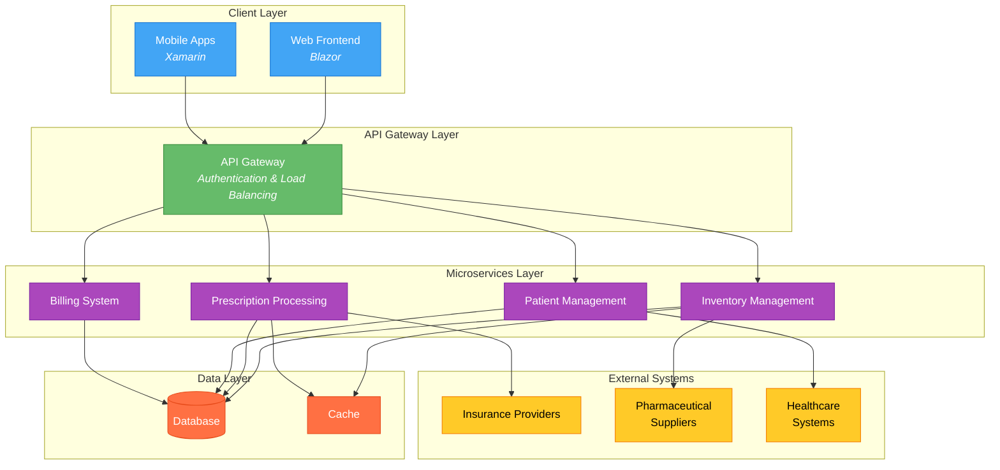

###Pharmacy Management System 

### Overview

The Pharmacy Management System is a modern, cloud-native application designed to streamline pharmacy operations while ensuring regulatory compliance and enhancing patient care. Built on Microsoft Azure with .NET technologies, this system provides a comprehensive solution for managing pharmacy operations, from inventory management to patient care.

### Key Benefits

1. **Scalability**  - Dynamic scaling capabilities through cloud infrastructure
  - Independent microservice scaling
  - Resource optimization based on demand

2. **Real-Time Data Access**  - Immediate access to critical pharmacy information
  - Live inventory tracking
  - Instant patient data retrieval

3. **Seamless Integration**  - Healthcare ecosystem connectivity
  - Insurance provider integration
  - Pharmaceutical supplier synchronization

### Features

#### Inventory Management

1. **Real-Time Stock Monitoring**  - Automated tracking of pharmaceutical products
  - Visual inventory dashboards
  - Low-stock threshold alerts

2. **Expiration Tracking**  - Advanced warning system for expiring medications
  - Automated reporting of near-expired items
  - First-expired-first-out (FEFO) management

3. **Barcode Scanning Integration**  - Industry-standard barcode support
  - Quick inventory updates
  - Error reduction in medication tracking

#### Prescription Processing

1. **Electronic Prescription Intake**  - Direct integration with healthcare providers
  - Secure e-prescription processing
  - Automated patient verification

2. **Multi-Step Verification**  - Pharmacist review workflow
  - Drug interaction checking
  - Dosage verification

3. **Refill Management**  - Automated refill tracking
  - Patient notification system
  - Insurance coverage verification

#### Patient Management

1. **Comprehensive Profiles**  - Demographic information storage
  - Medical history tracking
  - Allergy documentation
  - Medication history

2. **Insurance Management**  - Multiple plan support
  - Coverage verification
  - Claims processing

#### Billing and Payments

1. **Automated Insurance Claims**  - Real-time claim submission
  - Coverage verification
  - Reimbursement tracking

2. **Payment Processing**  - Credit card processing
  - FSA/HSA support
  - Electronic payment methods

#### Reporting and Analytics

1. **Sales Reports**  - Medication category breakdowns
  - Time period analysis
  - Payment method tracking

2. **Inventory Analytics**  - Turnover analysis
  - Popular medication tracking
  - Seasonal variation analysis

### Technical Architecture

The system follows a microservices architecture with clear separation of concerns 0:0. Each component is designed to be independently deployable and scalable.

The architecture diagram above illustrates the complete system flow, where:

- Blue components represent frontend applications
- Green represents the API gateway layer
- Purple shows the microservices layer
- Orange indicates data storage components
- Yellow represents external system integrations

#### Backend Technologies

- Languages: C#, VB.NET, SQL
- Frameworks: .NET Framework 4.x, .NET Core, Entity Framework Core
- Cloud Platforms: Microsoft Azure (primary), AWS (secondary)
- Database: SQL Server, Azure Cosmos DB, Redis Cache

#### Frontend Technologies

- Web: Blazor, HTML5/CSS3, JavaScript/TypeScript, Bootstrap
- Mobile: Xamarin, Xamarin.Forms
- Data Format: JSON, XML (HL7 compatibility), FHIR

#### DevOps Tools

- Containerization: Docker, Azure Container Registry
- CI/CD: Azure DevOps, GitHub Actions, NuGet
- Monitoring: Application Insights, Serilog, Elasticsearch/Kibana

### UI/UX Flows

#### 1. Prescription Processing Flow

The diagram above illustrates the system's architecture. Let me continue with the detailed UI/UX flows.

#### 2. Patient Management Flow

Let me continue with the detailed UI/UX flows and complete the documentation.

#### 2. Patient Management Flow

The patient management flow consists of several key interactions:

1. **Patient Profile Creation**  - Demographic information collection
  - Medical history documentation
  - Allergy recording
  - Insurance information linking

2. **Patient Search**  - Quick search by name or ID
  - Advanced search filters
  - Patient profile preview
  - Recent patient history

3. **Profile Management**  - Information editing
  - Document attachment
  - Medical history updates
  - Insurance coverage verification

#### 3. Inventory Management Flow

The inventory management process includes:

1. **Stock Monitoring**  - Real-time inventory dashboard
  - Low-stock alerts
  - Expiration tracking
  - Supplier order suggestions

2. **Order Processing**  - Automated purchase order generation
  - Supplier selection
  - Order tracking
  - Receipt verification

3. **Stock Updates**  - Barcode scanning integration
  - Manual quantity adjustments
  - Transfer management
  - Inventory reporting

### Development Workflow

1. **Feature Development**  - Create feature branch
  - Implement changes following coding standards
  - Run local tests
  - Submit pull request

2. **Code Review Process**  - Peer review of code changes
  - Automated test execution
  - Style guide compliance check
  - Documentation updates

### Deployment Process

1. **Preparation**  - Configure Azure resources
  - Set up deployment parameters
  - Prepare environment variables

2. **Execution**  - Run deployment script
  - Monitor deployment status
  - Verify service health

3. **Validation**  - Test core functionality
  - Verify integrations
  - Check performance metrics

### Best Practices

1. **SOLID Principles**  - Single Responsibility: Each class has one reason to change
  - Open/Closed: Components open for extension, closed for modification
  - Liskov Substitution: Derived classes maintain base class behavior

2. **Clean Code**  - Meaningful names for variables and methods
  - Small, focused functions
  - No duplicate code

3. **Testing Strategy**  - Continuous Integration: Tests
